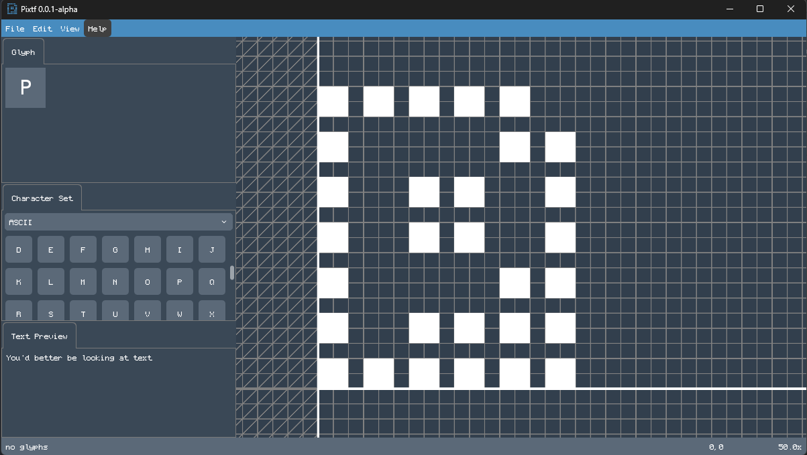
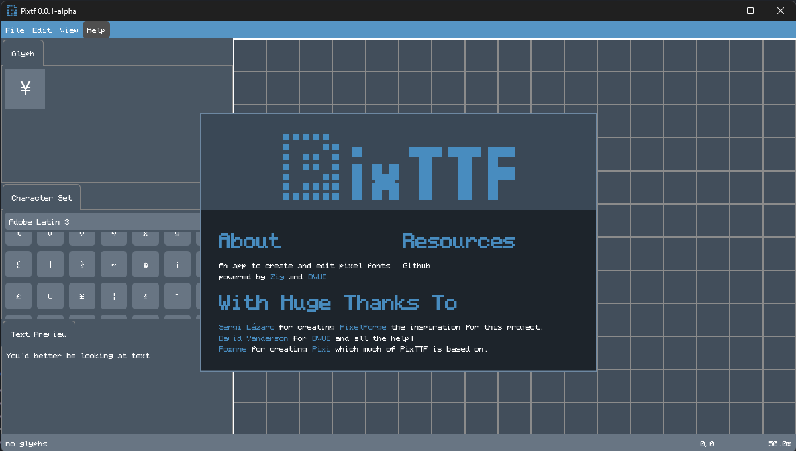

  
  
  <h3 align=center></h3>

#
**PixTTF** is an app to create and edit pixel fonts powered by [Zig](https://github.com/ziglang/zig) and [DVUI](https://github.com/david-vanderson/dvui)

> [!CAUTION]  
> PixTTF is currently under active development. The codebase is in a pre-alpha state and is not yet functional.

# Why?

<table align="right" style="width: auto; border: none; margin: 0; padding: 0;">
  <tr>
    <td style="border: none;">
       
      
    </td>
  </tr>
</table>

Right now there are two main ways to create pixel font TTFs.

One option is using a full-blown (and probably expensive) professional vector typeface design tool, and draw the pixel squares one by one. You might place a square off-grid, you might accidentally move a control point, etc. And the editing workflow is not ideal; you're not drawing pixels, you're editing curves!

Another option is to create all characters in one big image, using a pixel art editor, and using some kind of exporter script or external tool to cut them and assemble them into a TTF. What happens if you make a character wider or narrower? Do all characters need to be the same width? Can you use the entire Unicode space?

PixTTF is (and will always be) open source and free. While it draws *heavy inspiration* from [PixelForge](https://pixel-forge.com), they are separate projects. PixTTF was born because PixelForge is closed-source and currently unmaintained; I believe a tool this fundamental to indie game dev and digital art should be a community-driven.

All contributions are welcome! Anything helps improve this software, create an issue or pull request. No matter how small!

# Currently supported features
- [ ] Import TTF
- [ ] Export TTF
- [ ] Multiple sizes and weights for a single TTF
- [X] Unicode support
- [X] Character/glyph editor
- [X] Detailed glyph lookup
- [X] Typical pixel art operations (draw, erase, ~~bucket~~, ~~selection~~, ~~transformation~~)
- [ ] Text preview
- [ ] Infinite undo and redo history
- [ ] Auto-crash detection
- [X] Theming
- [ ] Tutorial
- [ ] Saving text preview as PNG
- [ ] Importing and exporting other formats (such as OTF)
- [ ] Copying characters to alternative versions
- [ ] Autosave

 

# Compile
<!-- will likely be needed in the future (stolen line from Pixi)
> [!NOTE]
> If you're on Linux ensure `gtk+3-devel` or similar is installed (for native file dialogs)
-->

- Install Zig 0.15.2
- Clone Pixttf
- Run `zig build`

# Credits
- [Sergi Lázaro](https://sergilazaro.com/) for creating [PixelForge](https://pixel-forge.com) the inspiration for this project.
- [David Vanderson](https://github.com/david-vanderson) for [DVUI](https://github.com/david-vanderson/dvui) and all the help!
- [Foxnne](https://github.com/foxnne) for creating [Pixi](https://github.com/foxnne/pixi) which many of Pixtff design choices are based off from.
